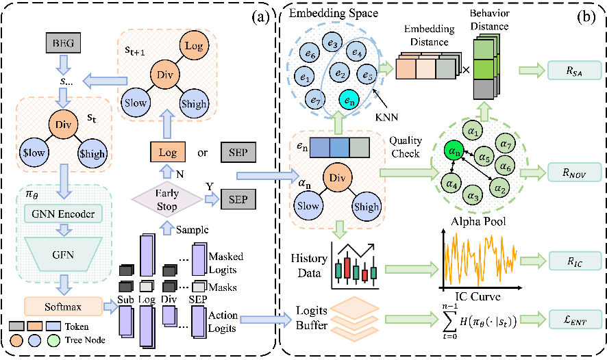

# <p align="center"> AlphaSAGE: Structure-Aware Alpha Mining via GFlowNets for Robust Exploration</p>

<p align="center">
  
  
  
</p>

---

</div>

This repository contains the official implementation of **AlphaSAGE** (Structure-Aware Alpha Mining via Generative Flow Networks for Robust Exploration), a novel framework for automated mining of predictive signals (alphas) in quantitative finance.

## 🎯 Overview

The automated mining of predictive signals, or alphas, is a central challenge in quantitative finance. While Reinforcement Learning (RL) has emerged as a promising paradigm for generating formulaic alphas, existing frameworks are fundamentally hampered by three interconnected issues:

1. **Reward Sparsity**: Meaningful feedback is only available upon completion of a full formula, leading to inefficient and unstable exploration
2. **Inadequate Representation**: Sequential representations fail to capture the mathematical structure that determines an alpha's behavior  
3. **Mode Collapse**: Standard RL objectives drive policies towards single optimal modes, contradicting the need for diverse, non-correlated alpha portfolios

## 🚀 Key Innovations

AlphaSAGE addresses these challenges through three cornerstone innovations:

### 1. Structure-Aware Encoder
- **Relational Graph Convolutional Network (RGCN)** based encoder that captures the inherent mathematical structure of alpha expressions
- Preserves semantic relationships between operators and operands
- Enables better understanding of formula behavior and properties

### 2. Generative Flow Networks (GFlowNets) Framework  
- Replaces traditional RL with GFlowNets for diverse exploration
- Naturally supports multi-modal sampling for generating diverse alpha portfolios
- Avoids mode collapse inherent in standard policy gradient methods

### 3. Dense Multi-Faceted Reward Structure
- Provides rich, intermediate feedback throughout the generation process
- Combines multiple evaluation criteria for comprehensive alpha assessment
- Enables more stable and efficient learning compared to sparse reward signals

The overview of AlphaSAGE is shown in the following figure:


## 📊 Results

Empirical results demonstrate that AlphaSAGE significantly outperforms existing baselines in:
- **Diversity**: Mining more diverse alpha portfolios
- **Novelty**: Generating novel alpha expressions  
- **Predictive Power**: Achieving higher predictive performance
- **Robustness**: Maintaining performance across different market conditions

The backtest results of AlphaSAGE is shown in the following figure:


*Detailed results and analysis can be found in our paper.*


## 🛠 Installation
We use PDM to manage the dependencies. To install PDM, please refer to the [official documentation](https://pdm-project.org/en/latest/).

```bash
git clone https://github.com/BerkinChen/AlphaSAGE.git
cd AlphaSAGE
pdm install
```

## 📁 Data Preparation

We use the data from [Qlib](https://github.com/microsoft/qlib) to train the model. Please refer to the [official documentation](https://qlib.readthedocs.io/en/latest/?badge=latest) to download the data.


## 🚀 Quick Start

AlphaSAGE operates in two main stages:

### Stage 1: Generate Alpha Pool with GFlowNets

Generate a diverse pool of alpha expressions using our structure-aware GFlowNets framework:

```bash
python train_gfn.py \
        --seed 0 \
        --instrument csi300 \
        --pool_capacity 50 \
        --log_freq 500 \
        --update_freq 64 \
        --n_episodes 10000 \
        --encoder_type gnn \
        --entropy_coef 0.01 \
        --entropy_temperature 1.0 \
        --mask_dropout_prob 1.0 \
        --ssl_weight 1.0 \
        --nov_weight 0.3 \
        --weight_decay_type linear \
        --final_weight_ratio 0.0
```

**Key Parameters:**
- `--encoder_type gnn`: Uses our structure-aware RGCN encoder
- `--pool_capacity 50`: Maximum number of alphas to maintain in the pool
- `--entropy_coef 0.01`: Controls exploration vs exploitation balance
- `--ssl_weight 1.0`: Self-supervised learning weight for structure awareness
- `--nov_weight 0.3`: Novelty reward weight for diversity

### Stage 2: Evaluate and Combine Alpha Pool

Following [AlphaForge](https://github.com/DulyHao/AlphaForge), we use adaptive combination to create the final alpha portfolio:

```bash
python run_adaptive_combination.py \
    --expressions_file results_dir\
    --instruments csi300 \
    --threshold_ric 0.015 \
    --threshold_ricir 0.15 \
    --chunk_size 400 \
    --window inf \
    --n_factors 20 \
    --cuda 2 \
    --train_end_year 2020 \
    --seed 0 \
```

## 🔬 Baselines and Comparisons

### AlphaQCM and AlphaGen Baselines

For comparison with [AlphaGen](https://github.com/RL-MLDM/alphagen) and [AlphaQCM](https://github.com/ZhuZhouFan/AlphaQCM), run the following commands:

#### AlphaQCM:

```bash
# Train AlphaQCM
python train_qcm.py \
    --instruments csi300 \
    --pool 20 \
    --seed 0

# Evaluate AlphaQCM results
python run_adaptive_combination.py \
    --expressions_file results_dir \
    --instruments csi300 \
    --cuda 2 \
    --train_end_year 2020 \
    --seed 0 \
    --use_weights True
```

#### AlphaGen (PPO):
```bash
# Train AlphaGen with PPO
python train_ppo.py \
    --instruments csi300 \
    --pool 20 \
    --seed 0

# Evaluate AlphaGen results  
python run_adaptive_combination.py \
    --expressions_file results_dir \
    --instruments csi300 \
    --cuda 2 \
    --train_end_year 2020 \
    --seed 0 \
    --use_weights True
```

### Other Baselines
For AlphaForge and other ML baselines, please refer to the [AlphaForge documentation](https://github.com/DulyHao/AlphaForge).

## 📄 License

This project is licensed under the MIT License - see the [LICENSE](LICENSE) file for details.

## 🤝 Contributing

We welcome contributions! Please feel free to submit a Pull Request.

## 📞 Contact

For questions or issues, please open an issue on GitHub or contact [cbq@stu.pku.edu.cn](cbq@stu.pku.edu.cn).
